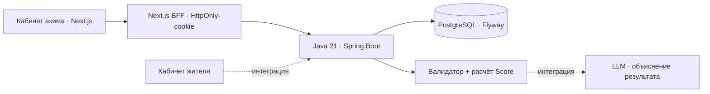
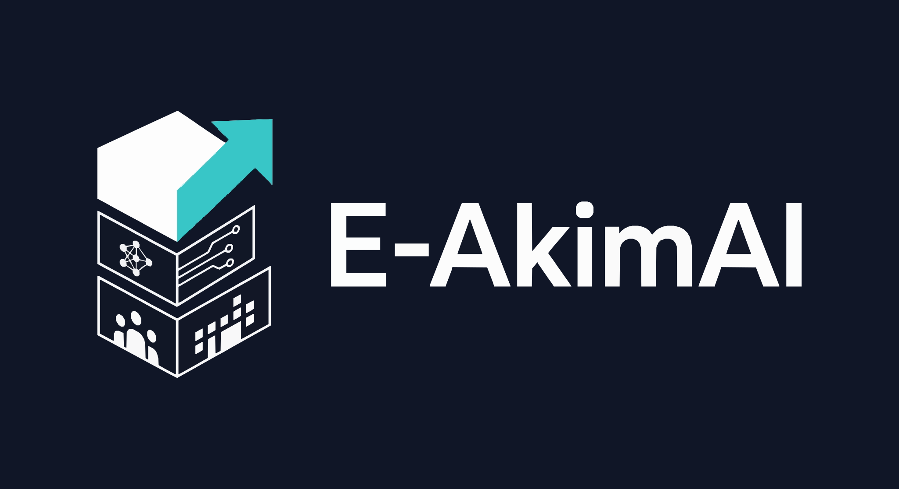

<<<<<<< HEAD
<div align="center">


# Город один. Решений — пять.

**Распределите бюджет Астаны и увидьте, кому ваши решения помогут больше всего.**

HackAlem AI 2026 · Спец-трек Astana Innovations · Команда **g4ymers**

[Проверить за 90 секунд](#demo) · [Запустить проект](#start) · [Что работает](#status) · [Как считается результат](#score)

</div>


Школа в Нуре, чистое топливо в Сарыарке, освещение улиц — у каждого решения есть цена и срок, а у районов разные потребности. **E-AkimAI позволяет проверить такой выбор до того, как он станет расходом городского бюджета.**

Вы выбираете пять инициатив на интерактивной карте. Симулятор проверяет ограничения, рассчитывает эффект и показывает изменения по районам. Формула учитывает и общий результат, и самый слабый район: развитие одного центра не компенсирует все оставшиеся проблемы.

> **100 единиц бюджета · 5 районов · 14 мероприятий · 10 показателей · 2 года моделирования**
>
> Числовые данные синтетические, из задания хакатона. Результат описывает учебную модель, а не прогноз реального развития Астаны.

<a id="demo"></a>

## Проверьте результат за 90 секунд

После [запуска](#start) откройте [кабинет акима](http://localhost:3000) и войдите своей локальной учётной записью.

1. **На стартовом экране нажмите «Попробовать готовый пример».** Приложение выберет пять мер за 95 единиц. Для собственного плана нажмите «Начать сценарий».
2. **Просмотрите инициативы и выбранный план в одной панели → «Проверить план».** Здесь видны районы, стоимость и предварительный Score.
3. **Нажмите «Завершить и сохранить».** Откроется итог: Score, изменения по районам, критические показатели и объяснение расчёта.
4. **Перезагрузите страницу → «Сохранённые».** Откройте сценарий: решения и результат сохранены в PostgreSQL.

| Что проверяем | До | После |
|---|---:|---:|
| **Astana Quality of Life Score** | **52.56** | **56.54** |
| Показатели ниже критического порога 40 | 2 | **0** |
| Расход бюджета | 0 | **95 из 100** |
| Принятые решения | 0 | **5 из 5** |

Контрольный набор: **M7 — школа и детсад, M8 — поликлиника, M10 — освещение и камеры в Нуре; M12 — цифровые обращения по городу; M5 — чистое топливо в Сарыарке.** Это пример из датасета, а не заявление об оптимальном наборе мер.

Для проверки чувствительности модели начните новый сценарий и измените меры или район. Для проверки ограничений попробуйте совместить автобусные полосы M1 и ЛРТ M3: система объяснит, почему набор недопустим.

## Почему это полезно

- **Решения имеют видимые последствия.** Карта связывает инициативы с конкретными районами, а сравнение показывает, где выросли показатели и где сохранились проблемы.
- **Компромиссы входят в модель.** Учтены стоимость, задержка эффекта, синергии, несовместимости и отрицательные последствия отдельных мер.
- **Результат можно воспроизвести.** Одинаковые исходные данные и решения дают одинаковый Score. Сценарии сохраняются и доступны для повторного просмотра.

<a id="status"></a>

## Что работает в этой версии

| Часть проекта | Состояние |
|---|---|
| Карта Астаны | Полный экран, пять районов ТЗ, ориентиры, масштабирование, поворот и плавный фокус |
| Кабинет акима | Вход, серверный каталог, выбор инициатив, бюджет и проверка ограничений |
| Расчёт результата | Java: показатели районов, Score, лаги, синергии и критические значения |
| Сценарии | Предпросмотр, сохранение, повторное открытие и завершение с фиксацией результата |
| Обращения в кабинете акима | Просмотр, фильтры, смена статуса и история через общий API |
| AI-разбор | **В интеграции.** В текущем фронтенде панель AI пока показывает заглушку |
| Кабинет жителя | Интерфейс готов; подключение к общему API и авторизации **в интеграции**, по умолчанию используются демоданные |

**Роль AI:** объяснить сильные стороны, риски и компромиссы уже рассчитанного сценария. По ТЗ LLM получает готовые числа, изменения показателей и выбранные меры. Численный Score рассчитывается кодом. Текущие серверные `explanations` формируются правилами; это ещё не ответ LLM.

Обращения и симулятор используют общий backend. При этом обращение само по себе не изменяет Score, а выбор мероприятия не закрывает обращение автоматически.

<a id="start"></a>

## Запуск

Основной сценарий проверки — **кабинет акима + Java API + PostgreSQL**. Команды выполняются из корня скачанного или клонированного репозитория, если не указан переход в другую папку.

### Вариант 1. Windows — проверенный локальный путь

Нужны **Node.js 22.18+**, **Java 21+**, **PostgreSQL 18** и **PowerShell 7**. Maven загружается через wrapper. При первой установке зависимостей требуется интернет.

В первом терминале PowerShell 7:

```powershell
.\backend\scripts\start-local-db.ps1
cd backend
.\mvnw.cmd package
cd ..
.\backend\scripts\start-api.ps1
```

Скрипт создаст отдельную локальную БД на порту **55432**. Flyway автоматически загрузит **5 районов, 10 показателей и 14 мероприятий**. Если PostgreSQL установлен по другому пути, передайте `-PostgresBin 'D:\PostgreSQL\18\bin'` первому скрипту.

Во втором терминале, из корня:

```powershell
cd akim
npm ci
npm run dev
```

Откройте **[http://localhost:3000](http://localhost:3000)**. Email и пароль акима создаются при первом запуске и находятся в полях `akimEmail` и `akimPassword` файла **`.local/dev-config.json`**. Файл локальный и исключён из Git. Регистрировать жителя для входа в кабинет акима не нужно.

Проверка доступности API и БД: **[http://localhost:8080/api/health](http://localhost:8080/api/health)**.

<details>
<summary><strong>Вариант 2. PostgreSQL и API через Docker Compose</strong></summary>

Нужны Docker Compose и Node.js 22.18+. Java и PostgreSQL устанавливаются внутри контейнеров.

1. Скопируйте [`.env.example`](.env.example) в `.env`. Задайте свои `DATABASE_PASSWORD`, `AKIM_EMAIL` и `AKIM_PASSWORD` — пароль акима минимум 12 символов.
2. Запустите сервер и базу:

```sh
docker compose up --build -d
```

3. Запустите фронтенд отдельно:

```sh
cd akim
npm ci
npm run dev
```

Адрес кабинета: [localhost:3000](http://localhost:3000). Данные для входа — `AKIM_EMAIL` и `AKIM_PASSWORD` из вашего `.env`. API: `localhost:8080`, PostgreSQL: `localhost:5433`.

Compose описывает только API и БД. Этот вариант подготовлен в репозитории; основной проверенный запуск выполнялся через локальный PostgreSQL на Windows. Одновременно запускать оба варианта на порту 8080 не нужно.

</details>

<details>
<summary><strong>Кабинет жителя и адрес другого backend</strong></summary>

Для просмотра интерфейса жителя из корня:

```sh
cd citizen/my-app
npm ci
npm run dev -- --port 3001
```

Откройте [localhost:3001/citizen](http://localhost:3001/citizen). Текущий режим — демоданные. Сквозной сценарий с общим API требует завершения интеграции авторизации.

Кабинет акима обращается к `http://127.0.0.1:8080` через сервер Next.js. Для другого адреса создайте `akim/.env.local`:

```dotenv
BACKEND_URL=http://127.0.0.1:8080
```

После изменения перезапустите фронтенд. Браузер использует `/api/backend/...`; Bearer-токен хранится в HttpOnly-cookie и передаётся Java API сервером Next.js. Production-вариант требует HTTPS для защищённой cookie.

</details>

## Архитектура



Пунктиром обозначены части, подключение которых ещё завершается.

| Слой | Технологии и ответственность |
|---|---|
| Интерфейсы | Next.js 16, React 19, TypeScript; карта и сценарии акима, обращения жителя |
| Общий backend | Java 21, Spring Boot 4, Spring Security; роли, обращения, валидация и расчёт |
| Хранение | PostgreSQL 18, Flyway; датасет, пользователи, обращения, история и сценарии |
| Карта | Локальная WebP-подложка из SVG и векторные контуры пяти районов; внешний картографический API не требуется |

<a id="score"></a>

## Как считается результат

```text
Score = 0.7 × средняя оценка по населению
      + 0.3 × оценка самого слабого района
      − число показателей ниже 40
```

Модель поощряет развитие города и поддержку отстающих районов. Каждый показатель строго ниже 40 отнимает один балл. Эффекты мероприятий учитывают задержку запуска на горизонте **8 кварталов**; синергии добавляются отдельно, показатели ограничены диапазоном **0–100**.

Сервер проверяет **ровно 5 уникальных мер**, стоимость **не больше 100**, **не больше 2 мер одного направления**, обязательный район локальной меры и все несовместимости. Черновик допускает меньше пяти мер, завершение — только полный допустимый набор. Выбирать по одной мере каждого направления не требуется.

Контрольные значения без округления: исходный Score **52.55768**, пример из задания **56.54307**. Округление применяется при отображении.

## Проверки и код

Фронтенд и тесты модели:

```sh
cd akim
npm ci
=======
# E-AkimAI · Astana City Lab

**Один бюджет. Пять решений. Город, который меняете вы.**

Интерактивный фронтенд для спец-трека Astana Innovations на HackAlem AI 2026. Команда g4ymers.

## Что работает

- Карта занимает весь экран: улицы, здания, река и векторные контуры пяти районов из ТЗ. Бюджет и Score расположены сверху, меню управления снизу; инициативы, сценарий и показатели открываются плавающими панелями поверх карты. На телефоне панели открываются снизу и прокручиваются отдельно.
- Перетаскивание мышью и касанием, масштаб до 1000%, обзор всех границ и режим «Только карта». Escape закрывает панель или возвращает интерфейс. Открытие панелей сохраняет положение и масштаб карты.
- Девять ориентиров с расположением из исходной карты: Байтерек, EXPO, MEGA Silk Way, Керуен, Abu Dhabi Plaza, Хан Шатыр, Астана Опера, Акорда и Дворец мира и согласия. Поиск приближает объект и выбирает район, если он входит в ТЗ.
- Каталог 14 мероприятий из задания с поиском и фильтрами.
- Выбор и удаление мероприятий, бюджет 100 единиц, контроль повторов, направлений и конфликтов.
- Вход акима через Spring Boot API; токен хранится в HttpOnly-cookie на стороне Next.js.
- Каталог, исходные показатели и Score загружаются с бэкенда. Предпросмотр рассчитывается сервером после каждого изменения плана; при ошибке предыдущий план сохраняется.
- Сохранение и обновление черновиков, библиотека собственных сценариев, завершение с блокировкой редактирования. Сохранённые планы открываются из базы после перезагрузки страницы.
- Обращения жителей: фильтры по району, статусу и направлению, карточка, история, комментарии и смена статуса с проверкой версии.
- Сравнение районов до и после решений, контрольный пример, правила и сброс сценария.
- Адаптивный интерфейс в чёрном, белом, фиолетовом и синем цветах.

**AI API пока не подключён.** Панель явно показывает этот статус. Показатели районов синтетические, из задания. Для работы необходимы Spring Boot API и PostgreSQL. Несохранённый план находится в памяти страницы; перед перезагрузкой есть предупреждение. Кнопка «Сохранить черновик» записывает план в БД.

## Запуск

Сначала запустите backend по инструкции в `../backend/README.md`. Учётные данные локального акима: `akimEmail` и `akimPassword` в `../.local/dev-config.json` (не коммитить). В кабинете акима учётная запись жителя не принимается.

Node.js 22.18+ и npm. Выполняйте команды в этой директории:

```bash
npm ci
npm run dev
```

Откройте [localhost:3000](http://localhost:3000). Для production-сборки: `npm run build`, затем `npm start`.

По умолчанию сервер Next.js обращается к `http://127.0.0.1:8080`. Для другого адреса создайте `.env.local`:

```dotenv
BACKEND_URL=http://127.0.0.1:8080
```

Это серверная переменная, префикс `NEXT_PUBLIC_` не нужен. После изменения перезапустите Next.js. В браузере запросы идут на `/api/backend/...`; CORS между браузером и Java не требуется. В production cookie требует HTTPS. При недоступном API показывается ошибка и возможность повторить запрос, локальной подмены данных нет.

«Завершить сценарий» сохраняет актуальный план и фиксирует итог. Завершённый сценарий доступен только для просмотра; для нового плана используйте кнопку «Новый сценарий». При конфликте версии интерфейс сохраняет введённый план и предлагает перезагрузить серверную версию через «Перезагрузить из базы».

## Проверка

```bash
>>>>>>> 1e0fd599a5448019ca7d59487a69081a666910be
npm test
npm run lint
npm run build
```

<<<<<<< HEAD
Тесты Java из папки `backend`: `./mvnw test` на Linux/macOS или `.\mvnw.cmd test` на Windows. Настройка тестов с настоящей БД описана в [документации backend](backend/README.md#проверки). HTTP-тесты требуют отдельного запуска окружения; обычный запуск тестов не означает прохождения интеграционных проверок.

Проверяются контрольный пример, бюджет, число и уникальность мер, район воздействия, ограничения направлений, несовместимости, лаги, синергии и критический порог.

| Где смотреть | Содержимое |
|---|---|
| [akim/](akim/README.md) | Кабинет акима, карта, BFF и инструкции по интеграции |
| [backend/](backend/README.md) | Общий API, авторизация, расчёт и сценарии |
| [citizen/my-app/](citizen/my-app/) | Интерфейс жителя |
| [Simulator.java](backend/src/main/java/kz/hackalem/city/simulation/Simulator.java) | Реализация формулы и валидации |
| [Миграция датасета](backend/src/main/resources/db/migration/V2__hackathon_dataset.sql) | Исходные показатели и каталог мероприятий |
| [Тесты модели](akim/tests/simulation.test.mjs) | Воспроизводимый контрольный сценарий и ограничения |

## Источники

- [Задание «Аким на 5 часов»](<HackAlem AI_ «Аким на 5 часов» - AI-симулятор управления городом.pdf>) — требования и критерии оценки.
- [Датасет районов](<Датасет районов.pdf>) — синтетические показатели, меры, веса и формула.
- Карта: предоставленный SVG на основе [© OpenStreetMap contributors](https://www.openstreetmap.org/copyright), ODbL. Происхождение геометрии и подготовка подложки описаны в [документации карты](akim/README.md#карта-и-архитектурные-ориентиры).

**E-AkimAI · g4ymers · HackAlem AI 2026 · Astana Innovations**
=======
HTTP-тест интеграции с работающим фронтендом и backend: задайте `AKIM_API_TEST=1`, `AKIM_TEST_EMAIL`, `AKIM_TEST_PASSWORD` для отдельной тестовой учётной записи акима, затем `npm test`. Необязательный `AKIM_FRONTEND_URL` по умолчанию равен `http://localhost:3000`. Тест создаёт сценарий у тестового пользователя. Он проверяет HttpOnly-cookie, защиту Origin, серверный расчёт, сохранение, конфликт версий, завершение и выход.

«Загрузить пример из задания» выбирает M7, M8 и M10 в Нуре, M12 для города и M5 в Сарыарке. Стоимость: **95**, итог: **56.54307** (на экране **56.54**) против стартовых **52.55768**. Критических показателей становится 0 вместо 2.

Тесты проверяют контрольный пример, бюджет, количество и уникальность мероприятий, районы, ограничения направлений, несовместимости, задержки, синергии, независимость от порядка и отрицательный эффект пересечения порога 40.

## Устройство

- `components/auth-gate.tsx` — вход, восстановление сессии и начальная загрузка.
- `app/api/backend/[...path]/route.ts` — серверный прокси к Java API, HttpOnly-cookie и проверка Origin.
- `lib/api.ts` — типизированный клиент и обработка ошибок.
- `components/workspace.tsx` — интерфейс и серверное состояние сценария.
- `components/scenario-library.tsx`, `components/reports-panel.tsx` — сохранённые планы и обращения.
- `components/city-map.tsx` — интерактивные слои, навигация и выбор районов.
- `public/maps/astana.svg` — локальная подробная картографическая подложка.
- `public/maps/astana.webp` — подготовленная подложка для плавной навигации.
- `lib/astana-map.json` — контуры пяти районов и координаты ориентиров из SVG.
- `scripts/prepare-map.py` — воспроизводимое извлечение и очистка исходной карты.
- `lib/simulation.ts` — справочная модель и тестовый датасет; клиент использует только форматирование и предварительную валидацию по загруженному каталогу. Отображаемый Score приходит из Java API.
- `tests/simulation.test.mjs` — контрольные тесты средствами Node.js.

Формула: `Score = 0.7 × средневзвешенная оценка + 0.3 × худший район − число показателей < 40`. Полные эффекты умножаются на `(8 − лаг) / 8`, синергии добавляются без уменьшения, значения ограничиваются диапазоном 0–100. Округление применяется только при отображении.

## Карта и архитектурные ориентиры

Основа — предоставленный `astana.svg`, экспорт osm2cdr на данных [© OpenStreetMap contributors](https://www.openstreetmap.org/copyright), ODbL. Геометрия дорог, зданий и воды сохранена; палитра приглушена. Удалены невидимые метаданные объектов, старые административные подписи и линии, вместо них наложены интерактивные контуры только **Есиля, Алматы, Сарыарки, Байконура и Нуры**. Сарайшык и прочая территория остаются нейтральными. Актуальность границ соответствует исходному SVG, а не отдельной проверке официального реестра.

Контуры извлечены из слоя «Границы». Разорванные части соединяются по совпадающим концам, отдельные участки сохранены. Скрипт проверяет замкнутость и попадание именованных опорных точек в каждый район. Координаты достопримечательностей взяты из слоя «Названия объектов»; район определяется попаданием точки в полигон. Дворец мира вне пяти районов ТЗ и не меняет выбор сценария. Маркеры мероприятий обозначают район воздействия, а не точный адрес строительства.

SVG очищен с 26,6 до 15,6 МБ и сохранён в проекте. Для плавной навигации браузер загружает его растровую копию WebP **7600 × 10531 (~2,7 МБ)**; прозрачные контуры районов, маркеры и подписи остаются векторными. Это сохраняет расположение объектов и избавляет от перерисовки десятков тысяч SVG-контуров при каждом перемещении. При сильном увеличении детализация подложки ограничена разрешением WebP. При первом открытии есть индикатор загрузки и повтор при ошибке. Для показа без интернета внешние карты и API-ключи не требуются.

Повторная генерация (Python 3, только стандартная библиотека):

```bash
python scripts/prepare-map.py /path/to/astana.svg
node scripts/render-map.mjs
```

SHA-256 исходника сохранён в `lib/astana-map.json`. Оригинальный пользовательский файл скрипт не изменяет.
>>>>>>> 1e0fd599a5448019ca7d59487a69081a666910be
