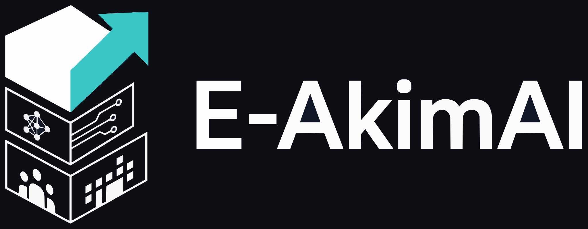
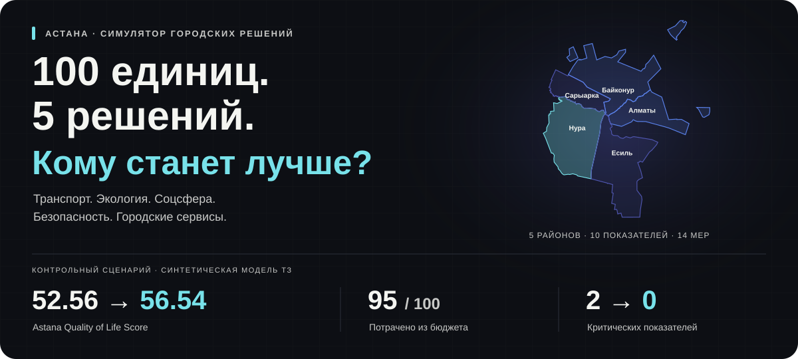
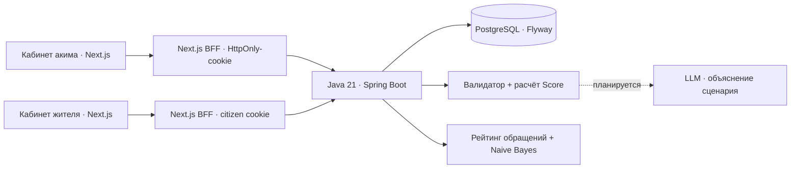

<div align="center">



# Город один. Решений — пять.

**Распределите бюджет Астаны и увидьте, кому ваши решения помогут больше всего.**

HackAlem AI 2026 · Спец-трек Astana Innovations · Команда **g4ymers**

[Проверить за 90 секунд](#demo) · [Запустить проект](#start) · [Что работает](#status) · [Как считается результат](#score)

</div>



Школа в Нуре, чистое топливо в Сарыарке, освещение улиц — у каждого решения есть цена и срок, а у районов разные потребности. **E-AkimAI позволяет проверить такой выбор до того, как он станет расходом городского бюджета.**

Вы выбираете пять инициатив на интерактивной карте. Симулятор проверяет ограничения, рассчитывает эффект и показывает изменения по районам. Формула учитывает и общий результат, и самый слабый район: развитие одного центра не компенсирует все оставшиеся проблемы.

**Житель отмечает проблему на карте → аким видит обращение → проверяет варианты развития города.** Оба кабинета используют общую базу и единый тёмный интерфейс E-AkimAI. Создать обращение можно в три шага, без QR-кода.

> **100 единиц бюджета · 5 районов · 14 мероприятий · 10 показателей · 2 года моделирования**
>
> Числовые данные синтетические, из задания хакатона. Результат описывает учебную модель, а не прогноз реального развития Астаны.

<a id="demo"></a>

## Проверьте результат за 90 секунд

После [запуска](#start) откройте [кабинет акима](http://localhost:3000) и войдите своей локальной учётной записью.

1. **На стартовом экране нажмите «Попробовать готовый пример».** Приложение выберет пять мер за 95 единиц. Для собственного плана нажмите «Начать сценарий».
2. **Просмотрите инициативы и выбранный план в одной панели → «Проверить план».** Здесь видны районы, стоимость и предварительный Score.
3. **Нажмите «Завершить и сохранить».** Откроется итог: Score, изменения по районам, критические показатели и объяснение расчёта.
4. **Перезагрузите страницу → «Сохранённые».** Откройте сценарий: решения и результат сохранены в PostgreSQL.

| Что проверяем | До | После |
|---|---:|---:|
| **Astana Quality of Life Score** | **52.56** | **56.54** |
| Показатели ниже критического порога 40 | 2 | **0** |
| Расход бюджета | 0 | **95 из 100** |
| Принятые решения | 0 | **5 из 5** |

Контрольный набор: **M7 — школа и детсад, M8 — поликлиника, M10 — освещение и камеры в Нуре; M12 — цифровые обращения по городу; M5 — чистое топливо в Сарыарке.** Это пример из датасета, а не заявление об оптимальном наборе мер.

Для проверки чувствительности модели начните новый сценарий и измените меры или район. Для проверки ограничений попробуйте совместить автобусные полосы M1 и ЛРТ M3: система объяснит, почему набор недопустим.

## Почему это полезно

- **Решения имеют видимые последствия.** Карта связывает инициативы с конкретными районами, а сравнение показывает, где выросли показатели и где сохранились проблемы.
- **Компромиссы входят в модель.** Учтены стоимость, задержка эффекта, синергии, несовместимости и отрицательные последствия отдельных мер.
- **Результат можно воспроизвести.** Одинаковые исходные данные и решения дают одинаковый Score. Сценарии сохраняются и доступны для повторного просмотра.
- **Жители показывают, где нужна помощь.** Обращения поступают в общий кабинет акима; рейтинг по обращениям и ML-рекомендации выделяют проблемные адреса.

<a id="status"></a>

## Что работает в этой версии

| Часть проекта | Состояние |
|---|---|
| Карта Астаны | Пять районов ТЗ, ориентиры, масштабирование, поворот и плавный фокус в обоих кабинетах; у акима карта на весь экран |
| Кабинет акима | Вход, серверный каталог, выбор инициатив, бюджет и проверка ограничений |
| Гайд акима | «Как пользоваться»: сценарий, обращения, два рейтинга, AI-советы и карта; переходы в нужные панели без изменения плана |
| Расчёт результата | Java: показатели районов, Score, лаги, синергии и критические значения |
| Сценарии | Предпросмотр, сохранение, повторное открытие и завершение с фиксацией результата |
| Обращения в кабинете акима | Просмотр, фильтры, смена статуса и история через общий API |
| Кабинет жителя | Вход по ИИН; карта → описание → проверка и отправка. QR остаётся дополнительным способом выбрать место |
| Обращения жителя | Свои заявки со статусами и фильтрами, публичный журнал решённых проблем, карточки, комментарии и профиль через общий API |
| Карта обращений | Отметки собственных обращений и публичных решённых проблем; район определяется по выбранной точке |
| Единый стиль | Логотип E-AkimAI, тёмный фон, синие и бирюзовые акценты, адаптивные панели и обучение в обоих кабинетах |
| Рейтинг по обращениям | Данные PostgreSQL: активные проблемы снижают оценку, решённые снимают нагрузку и дают ограниченный бонус |
| ML-рекомендации | Naive Bayes определяет тему жалоб; рекомендации группируются по адресам и числу разных жителей |
| LLM-разбор сценария | Внешняя LLM пока не подключена; объяснения результата формируются правилами |

**Что делает AI сейчас:** локальный классификатор обучается на 32 синтетических примерах по 8 темам и предлагает действия для повторяющихся проблем по конкретным адресам. При низкой уверенности требуется проверка на месте. Качество на реальных обращениях ещё не оценено. Панель «Предложения ИИ» показывает эти рекомендации; внешний AI API для неё не нужен.

**Численный Score рассчитывается кодом.** Серверные `explanations` формируются правилами. LLM, которая объясняет сильные стороны и компромиссы сценария по готовым числам, остаётся отдельным этапом интеграции.

Обращения и симулятор используют общий backend. **Рейтинг по обращениям и сценарный Score — разные оценки:** обращение само по себе не изменяет Score симуляции, а выбор мероприятия не закрывает обращение автоматически. Коэффициенты рейтинга — прозрачная стартовая настройка, не официальная оценка районов.

### Сценарий проверки: житель → аким

1. В кабинете жителя откройте **«Сообщить о проблеме» → карту**. Укажите точку в одном из пяти районов, заполните адрес и подтвердите место.
2. Добавьте описание, направление и срочность → **«Проверить обращение» → «Отправить обращение»**. Камера, GPS и QR для этого пути не нужны.
3. Откройте **«Мои обращения»**: заявка находится в личном списке. Активные обращения других жителей скрыты; публичный журнал показывает решённые.
4. В кабинете акима откройте **«Обращения»**, выберите район и обработайте заявку. Проверьте её статус у жителя через **«Обновить список»**.
5. В панели района акима посмотрите **рейтинг по обращениям**, а в «AI» — предложения по темам и адресам. Эффект выбранных инициатив проверяется отдельно, в сценарии развития.

<a id="start"></a>

## Запуск

Основной сценарий проверки — **кабинет акима + Java API + PostgreSQL**. Команды выполняются из корня скачанного или клонированного репозитория, если не указан переход в другую папку.

### Вариант 1. Windows — проверенный локальный путь

Нужны **Node.js 22.18+**, **Java 21+**, **PostgreSQL 18** и **PowerShell 7**. Maven загружается через wrapper. При первой установке зависимостей требуется интернет.

В первом терминале PowerShell 7:

```powershell
.\backend\scripts\start-local-db.ps1
cd backend
.\mvnw.cmd package
cd ..
.\backend\scripts\start-api.ps1
```

Скрипт создаст отдельную локальную БД на порту **55432**. Flyway автоматически загрузит **5 районов, 10 показателей и 14 мероприятий**. Если PostgreSQL установлен по другому пути, передайте `-PostgresBin 'D:\PostgreSQL\18\bin'` первому скрипту.

Во втором терминале, из корня:

```powershell
cd akim
npm ci
npm run dev
```

Откройте **[http://localhost:3000](http://localhost:3000)**. Email и пароль акима создаются при первом запуске и находятся в полях `akimEmail` и `akimPassword` файла **`.local/dev-config.json`**. Файл локальный и исключён из Git. Регистрировать жителя для входа в кабинет акима не нужно.

Проверка доступности API и БД: **[http://localhost:8080/api/health](http://localhost:8080/api/health)**.

<details>
<summary><strong>Вариант 2. PostgreSQL и API через Docker Compose</strong></summary>

Нужны Docker Compose и Node.js 22.18+. Java и PostgreSQL устанавливаются внутри контейнеров.

1. Скопируйте [`.env.example`](.env.example) в `.env`. Задайте свои `DATABASE_PASSWORD`, `AKIM_EMAIL` и `AKIM_PASSWORD` — пароль акима минимум 12 символов.
2. Запустите сервер и базу:

```sh
docker compose up --build -d
```

3. Запустите фронтенд отдельно:

```sh
cd akim
npm ci
npm run dev
```

Адрес кабинета: [localhost:3000](http://localhost:3000). Данные для входа — `AKIM_EMAIL` и `AKIM_PASSWORD` из вашего `.env`. API: `localhost:8080`, PostgreSQL: `localhost:5433`.

Compose описывает только API и БД. Этот вариант подготовлен в репозитории; основной проверенный запуск выполнялся через локальный PostgreSQL на Windows. Одновременно запускать оба варианта на порту 8080 не нужно.

</details>

<details>
<summary><strong>Кабинет жителя и адрес другого backend</strong></summary>

Для запуска кабинета жителя из корня:

```sh
cd citizen/my-app
npm ci
npm run dev -- --port 3001
```

Откройте [localhost:3001/citizen](http://localhost:3001/citizen). Житель регистрируется и входит по ИИН и паролю; это учётная запись приложения, без проверки личности через eGov. Данные загружаются из общего API, ошибки не подменяются демоданными. Сессии жителя и акима независимы.

Основной путь создания заявки — [карта города](http://localhost:3001/citizen/map): место → описание → проверка и отправка. QR-код необязателен. На карте показаны собственные обращения и публичные решённые проблемы. Подробности — в [README кабинета жителя](citizen/my-app/README.md).

Для наполненной демонстрации доступны 25 синтетических жителей, 5 QR-точек и 75 обращений. Они создаются только при явном включении `DEMO_RESIDENTS=true` и заданном `DEMO_RESIDENT_PASSWORD` в окружении backend. Настройка и тестовые QR описаны в [документации backend](backend/README.md#синтетические-жители-и-безопасное-расширение-бд).

Кабинет акима обращается к `http://127.0.0.1:8080` через сервер Next.js. Для другого адреса создайте `akim/.env.local`:

```dotenv
BACKEND_URL=http://127.0.0.1:8080
```

После изменения перезапустите фронтенд. Браузер использует `/api/backend/...`; Bearer-токен хранится в HttpOnly-cookie и передаётся Java API сервером Next.js. Production-вариант требует HTTPS для защищённой cookie.

Тот же `BACKEND_URL` можно задать в `citizen/my-app/.env.local`. Для необязательных камеры и геолокации в QR-сценарии на телефоне нужен HTTPS; путь через карту их не запрашивает. Загрузка фотографий пока не реализована.

</details>

## Архитектура



Пунктиром обозначен запланированный LLM-разбор; оба кабинета и локальный ML используют общий работающий API.

| Слой | Технологии и ответственность |
|---|---|
| Интерфейсы | Next.js 16, React 19, TypeScript; интерактивная карта в обоих кабинетах, сценарии акима и обращения жителя |
| Общий backend | Java 21, Spring Boot 4, Spring Security; роли, обращения, валидация, расчёт и аналитика |
| ML | Multinomial Naive Bayes; обучающие примеры в PostgreSQL, группировка жалоб по теме и адресу |
| Хранение | PostgreSQL 18, Flyway; датасет, пользователи, обращения, история и сценарии |
| Карта | Локальная WebP-подложка из SVG и векторные контуры пяти районов; внешний картографический API не требуется |

<a id="score"></a>

## Как считается результат

```text
Score = 0.7 × средняя оценка по населению
      + 0.3 × оценка самого слабого района
      − число показателей ниже 40
```

Модель поощряет развитие города и поддержку отстающих районов. Каждый показатель строго ниже 40 отнимает один балл. Эффекты мероприятий учитывают задержку запуска на горизонте **8 кварталов**; синергии добавляются отдельно, показатели ограничены диапазоном **0–100**.

Сервер проверяет **ровно 5 уникальных мер**, стоимость **не больше 100**, **не больше 2 мер одного направления**, обязательный район локальной меры и все несовместимости. Черновик допускает меньше пяти мер, завершение — только полный допустимый набор. Выбирать по одной мере каждого направления не требуется.

Контрольные значения без округления: исходный Score **52.55768**, пример из задания **56.54307**. Округление применяется при отображении.

## Проверки и код

Фронтенд и тесты модели:

```sh
cd akim
npm ci
npm test
npm run lint
npm run build
```

Тесты Java из папки `backend`: `./mvnw test` на Linux/macOS или `.\mvnw.cmd test` на Windows. Настройка тестов с настоящей БД описана в [документации backend](backend/README.md#проверки). HTTP-тесты требуют отдельного запуска окружения; обычный запуск тестов не означает прохождения интеграционных проверок.

HTTP-тесты фронтенда акима включаются через `AKIM_API_TEST=1`, `AKIM_TEST_EMAIL` и `AKIM_TEST_PASSWORD` для отдельной тестовой учётной записи; необязательный `AKIM_FRONTEND_URL` по умолчанию равен `http://localhost:3000`. Проверки жителя и цепочки «обращение → аким → рейтинг → решение» запускаются последовательно командой `npm run test:integration` из `citizen/my-app` с переменными из [инструкции тестирования](citizen/my-app/README.md#проверка). Оба frontend должны обращаться к одному отдельному тестовому backend и БД: проверки создают жителей, обращения и сценарии.

Проверяются контрольный пример, бюджет, число и уникальность мер, район воздействия, ограничения направлений, несовместимости, лаги, синергии и критический порог.

| Где смотреть | Содержимое |
|---|---|
| [akim/](akim/README.md) | Кабинет акима, карта, BFF и инструкции по интеграции |
| [backend/](backend/README.md) | Общий API, авторизация, расчёт, сценарии, рейтинг и ML |
| [citizen/my-app/](citizen/my-app/README.md) | Карта, форма обращения, личный список, публичный журнал и обучение жителя |
| [Simulator.java](backend/src/main/java/kz/hackalem/city/simulation/Simulator.java) | Реализация формулы и валидации |
| [Миграция датасета](backend/src/main/resources/db/migration/V2__hackathon_dataset.sql) | Исходные показатели и каталог мероприятий |
| [Аналитика](backend/src/main/java/kz/hackalem/city/analytics/) | Рейтинг обращений, классификатор тем и рекомендации |
| [Тесты модели](akim/tests/simulation.test.mjs) | Воспроизводимый контрольный сценарий и ограничения |

## Источники

- [Задание «Аким на 5 часов»](<HackAlem AI_ «Аким на 5 часов» - AI-симулятор управления городом.pdf>) — требования и критерии оценки.
- [Датасет районов](<Датасет районов.pdf>) — синтетические показатели, меры, веса и формула.
- Карта: предоставленный SVG на основе [© OpenStreetMap contributors](https://www.openstreetmap.org/copyright), ODbL. Происхождение геометрии и подготовка подложки описаны в [документации карты](akim/README.md#карта-и-архитектурные-ориентиры).

**E-AkimAI · g4ymers · HackAlem AI 2026 · Astana Innovations**
